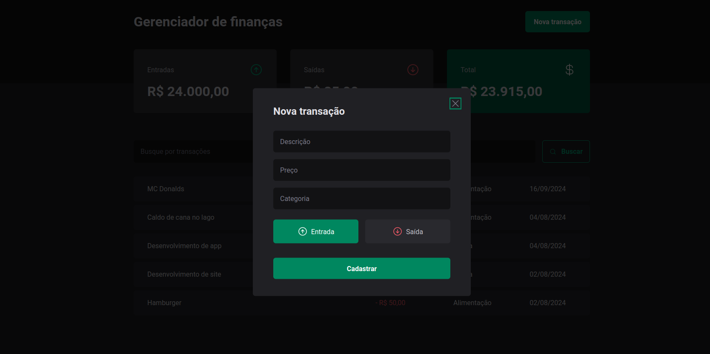
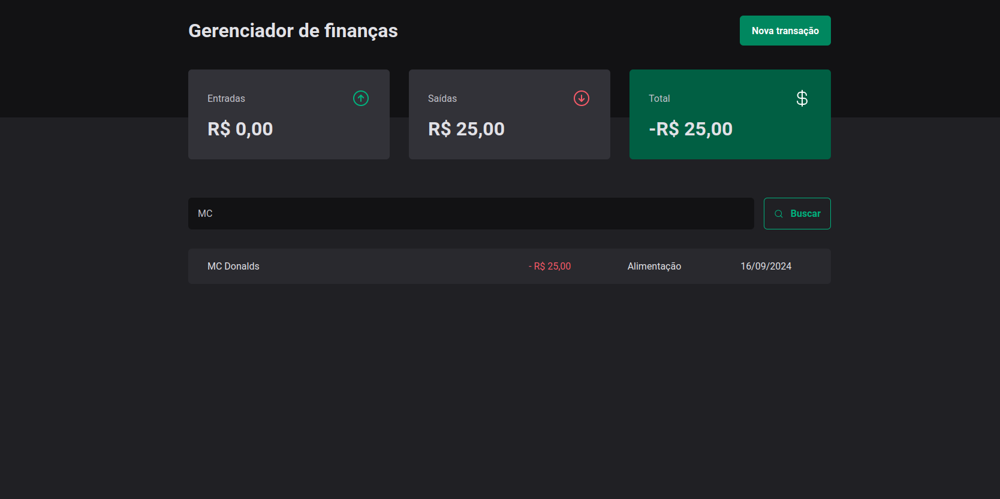

# Gerenciador de Financas

###

O **Gerenciador de finanças** é uma aplicação onde o usuário pode ter um controle dos seus gastos pessoais, podendo adicionar a categoria e tipo de gasto.

<div align="center">
  
</div>

---

## Funcionalidades

- **Resumo total de gastos**: Na tela inicial, o usuário tem acesso a um dashboard contendo um quadro com o total de entradas, outro com o total de saídas e o total geral que é o valor total de entradas subtraído pelo valor total de saídas. Além disso ele tem uma tabela exibindo todas as movimentações que ele possui.

---

- **Adicionar nova transação**: Ao clicar no botão "Nova transação", é aberto um modal onde o usuário pode cadastrar uma nova transação, inserindo a descrição, preço, categoria e informar se o valor é uma entrada ou saída de dinheiro. Por padrão o modal vem com a opção **Entrada** selecionada.

<div align="center">
  
</div>

---

- **Filtro por nome de transação**: Além de visualizar a lista de transações, o usuário pode ainda filtrar pelo nome da transaçao que deseja obter mais detalhes. Ao filtrar, os quadros de Entradas, Saídas e Total também é modificado com base na quantidade de transações que aparece em tela.

<div align="center">
  
</div>

---

## Tecnologias Utilizadas
- [React](https://react.dev/)
- [TypeScript](https://www.typescriptlang.org/)
- [Styled Components](https://styled-components.com/)
- [Zod](https://zod.dev/)
- [React Hook Form](https://react-hook-form.com/)
- [Vite](https://vitejs.dev/)
- [Phosphor Icons](https://phosphoricons.com/)
- [Eslint](https://eslint.org/)
- [JSON Server](https://github.com/typicode/json-server)

---

## Instalação e Execução

Antes de começar, certifique-se de ter as seguintes ferramentas instaladas em seu sistema:

- [Node.js](https://nodejs.org/) (versão 18 ou superior, para esse projeto eu utilizei a versão 20.14.0)
- [npm](https://www.npmjs.com/) ou [Yarn](https://classic.yarnpkg.com/) (gerenciador de pacotes)

## Instalação

1. **Clone o Repositório**

   Se ainda não tiver o repositório clonado, faça isso com o comando:

- HTTPS:
   ```bash
   git clone https://github.com/edu-almeidaf/finance-manager.git
   ```

- SSH:
   ```bash
   git clone git@github.com:edu-almeidaf/finance-manager.git
   ```
##

2. **Navegue até o diretório do projeto**
   ```bash
   cd gerenciador-de-financas
   ```
##

3. **Instale as dependências**

    Você pode instalar as dependências usando npm ou yarn:
- npm:
    ```bash
    npm install
    ```
- yarn:
    ```bash
    yarn install
    ```
##

4. **Inicie o servidor**

    Esse projeto utilizar um servidor com o JSON server, você precisa rodá-lo para o projeto funcionar.
- npm:
    ```bash
    npm run dev:server
    ```
- yarn:
    ```bash
    yarn dev:server
    ```

5. **Rode o projeto**
- npm:
    ```bash
    npm run dev
    ```
- yarn:
    ```bash
    yarn dev
    ```

## Avisos:
- Caso opte por rodar o projeto com Yarn, remova o arquivo package-lock.json. Isso garantirá que o arquivo yarn.lock seja utilizado corretamente

- Esse projeto roda na porta **5173**. Caso já tenha outro serviço rodando nesta porta, pode facilmente substituir a porta dentro do arquivo `vite.config.ts`. Para isso, basta adicionar a chave `server` conforme o exemplo abaixo:

  ```bash
  import { defineConfig } from 'vite'
  import path from 'path'
  import react from '@vitejs/plugin-react'

  // https://vitejs.dev/config/
  export default defineConfig({
    plugins: [react()],
    resolve: {
      alias: {
        '@': path.resolve(__dirname, './src'),
      },
    },
    server: {
      port: 5173 //Número da porta desejada
    }
  })
  ```
---

## Contribuição

Contribuições são bem-vindas! Se você quiser sugerir melhorias, relatar bugs ou contribuir com código, siga estas etapas:

1. Faça um fork do repositório.
2. Crie uma branch com a nova funcionalidade ou correção de bug: `git checkout -b feature/nova-funcionalidade`.
3. Commit suas mudanças: `git commit -m 'Adiciona nova funcionalidade'`.
4. Envie para a branch original: `git push origin feature/nova-funcionalidade`.
5. Abra um Pull Request.

---

## Contato

Se você tiver dúvidas ou sugestões, entre em contato:

- Email: [eduardoa.fernandes@hotmail.com](mailto:eduardoa.fernandes@hotmail.com)
- LinkedIn: [Eduardo de Almeida Fernandes](https://linkedin.com/in/almeidaedu)

---

## Licença

Este projeto está licenciado sob os termos da [MIT License](./LICENSE).